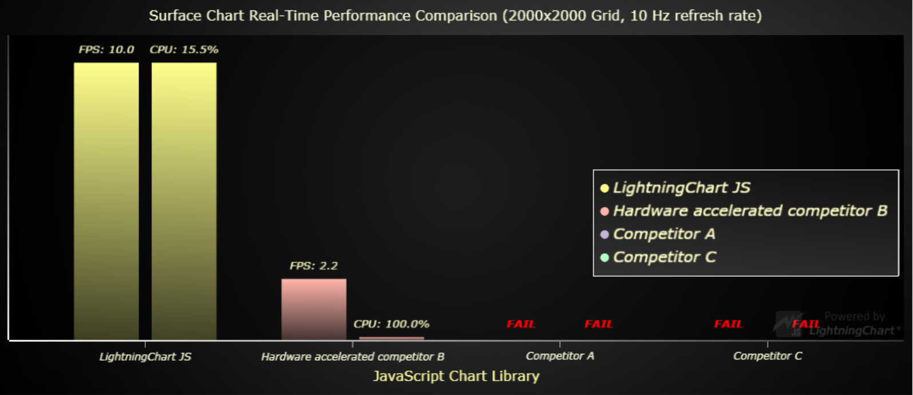

Public comparison of [LightningChart® JS](https://www.arction.com/lightningchart-js/) performance against other JavaScript charting libraries in visualizing different 3D Surface grid charts.

Surface grid charts are used for visualizing of at least 3-dimensional data which exists on a plane (usually referred as X and Z axes). The best way to understand this scenario is visualization of geospatial information, which has latitude (X), longitude (Z) and height (Y) values.

Additionally, surface grid charts are also used in 4-dimensional data visualization by coloring the surface dynamically based on a 4th data dimension.

For testing performance in different types of applications, we have identified 3 different application types of surface grid charts:

1. **Static surface chart**. A height map data set is loaded and rendered as surface chart.

2. **Refreshing surface chart**. In this case, the data is dynamic changing every so often (_refresh rate_). Used in real-time monitoring / analysis of geospatial data.

https://user-images.githubusercontent.com/55391673/143197285-60e5fc5c-38c6-4652-8914-55957cabb03f.mp4

3. **Appending surface chart**. Also dynamic data, but in this case the previous data is not cleared, instead just shifted out as new data is pushed in. Used in audio monitoring and analysis (spectrograms), for example.

https://user-images.githubusercontent.com/55391673/143197699-a8d979c4-d1ef-44a1-9828-0bd893e74b93.mp4

## Static performance comparison breakdown

We have a selected a single test from the set of static performance tests that were run for each included chart library. This test is the same for each library and it highlights the performance differences most effectively.

Here are the results of static surface grid chart test with 2000x2000 data points.

| JavaScript Chart Library | Loading speed (milliseconds) |
|:---|:---|
| LightningChart JS | 152 |
| Hardware accelerated competitor A | 1302 |
| Competitor B with no hardware acceleration | 14598 |

## Refreshing performance comparison breakdown

We have a selected a single test from the set of refreshing performance tests that were run for each included chart library. This test is the same for each library and it highlights the performance differences most effectively.

Here are the results of refreshing (refresh rate = 10 Hz) surface grid chart test with 2000x2000 data points.

| JavaScript Chart Library | Actual refresh rate /s | CPU Usage (%) |
|:---|:---|:---|
| LightningChart JS | 10.0 | 15.5 |
| Hardware accelerated competitor A | 2.2 | 100.0 |
| Competitor B with no hardware acceleration | FAIL | FAIL |

Below is a bar chart visualization of this same results table.

To help understand viewers to understand the effects of bad refresh rate and CPU usage measurements we have created a [YouTube video showcasing the charts](https://www.youtube.com/watch?v=Op_iu5urRk0) mentioned here undertaking the refreshing surface chart performance test (**not necessarily with same parameters as the test case highlighted above!**). In this video you can visible see how a low FPS looks on a web page, and respectively how a good FPS looks.

## Appending performance comparison breakdown

We have a selected a single test from the set of appending performance tests that were run for each included chart library. This test is the same for each library and it highlights the performance differences most effectively.

Here are the results of appending surface grid chart test with sample size 500, samples added per second 200 and sample history 10 seconds.

| JavaScript Chart Library | Refresh rate (FPS) | CPU Usage (%) |
|:---|:---|:---|
| LightningChart JS | 60.0 | 7.5 |
| Hardware accelerated competitor A | 5.8 | 100.0 |
| Competitor B with no hardware acceleration | 0.7 | 100.0 |

Below is a bar chart visualization of this same results table.

To help understand viewers to understand the effects of bad refresh rate and CPU usage measurements we have created a [YouTube video showcasing the charts](https://www.youtube.com/watch?v=Vlwf6n3ptFc) mentioned here undertaking the appending surface chart performance test (**not necessarily with same parameters as the test case highlighted above!**). In this video you can visible see how a low FPS looks on a web page, and respectively how a good FPS looks.
